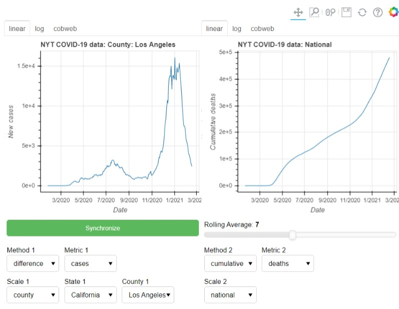

# covid

Interactive visualization from NYT statistics

- You can use `covid_plotter.py` to automatically generate the exploratory dashboard as html.
- `covid_static.ipynb` is a jupyter notebook along the same lines.
- `covid_analysis.ipynb` was a midterm project for MS 141.
